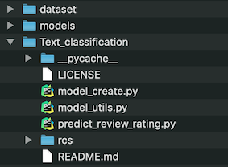

# Text classification
Text classification using fastText open-source library created by [Facebook's AI Research Lab](https://research.fb.com/category/facebook-ai-research/) (FAIR).

## Key takeaways
- Learn NLP basics, especially text classification task.
- Understand the difference between softmax and and hierarchical softmax activation functions for classification problems and why it vastly reduces time complexity of model training (great article about this topic can be found [here](http://building-babylon.net/2017/08/01/hierarchical-softmax/)).

## How to run ?
```
python predict_review_rating.py "My review commentary about some restaurant or bar \!"
```

Note: be careful about some characters like "!" for example, don't forget to use the escape character otherwise you'll get bash errors.

To replicate my model you will need to download the yelp JSON dataset available [here](https://www.yelp.com/dataset/download).

Your directory structure should be according to these at the start of the main function in predict_review_rating.py. However you can easily modify it.

Here is the one I used :



**Output example**:


    
## Main sources
- [fastText github](https://github.com/facebookresearch/fastText/)
- [fastText website](https://fasttext.cc/)
- [Great video with Piotr Bojanowski about fastText](https://www.youtube.com/watch?v=CHcExDsDeHU)
- [Research article about fastText](https://arxiv.org/abs/1612.03651)
